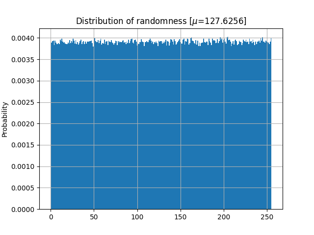

# RP2040 hardware random number generator


This is a fork of a previous modification fo pico_rng by polhenarejos

Newer changes include:
* now about 5x speedup in throughput of generated entropy at roughly 300k/s achieved partially by using the rp2040 FIFO and DMA features to do more efficient mass scale high frequency batched reads of the adc. 
* a little more sophisticated with the treatment of entropy sources, namely, being careful with bitwise operations to update the hash function with only 8 bits as specified in the specs for that
* also comparing the adc values to eachother as a source of entropy, as they generally are floating around a constant value, we are interested in the noise contained in short term changes in the readings


Changes include:
* driver updated, added included headers that were preventing my system from compiling it
* driver modified so that it presents the devnode fs object with permissins 0644 so that users can read it
* the hashing function implemented in the firmware was done incorrectly, updating in 64 bit blocks when specs have it at 8 bits/1byte per round.  fixed this to follow specs. 
* some entropy from the ADC connected to the temperature sensor integral to the RP2040, providing another source of physical entropy
* speed improvement removing some redundancy, resulting in 2x speed improvement of entropy produced
* organized the test scripts a little better

##prerequisites
* linux headers for your kernel
* pico sdk, add it to your path like below

```bash
sudo apt install linux-headers-generic
git clone https://github.com/raspberrypi/pico-sdk
cd pico-sdk
git submodule update --init  --recursive
export PICO_SDK_PATH=`pwd`
echo "export PICO_SDK_PATH=`pwd`" >> .bashrc 
#^ adds the pico SDK to path to your environment in your shell pemanently where cmake on projects like this can find it
apt install dieharder 
#optionally if you are modifying it and want to run the industry standard battery of tests
```

## build fw
```bash
mkdir build
cd build
cmake ..
make
```

## upload fw
```bash
cp build/firmware/pico_rng.uf2 /media/$USER/RPI-RP2
```

##build driver
```bash
cd driver
mkdir build
cd build
cmake ..
make
```

##load up driver
```bash
sudo insmod driver/pico_rng.ko [debug=1] [timeout=<msec timeout>]
```

##run basic tests
```bash
test/tests.sh
```

##run extensive benchmark on quality of produced entropy
```bash
apt install dieharder
test/pico_rng_test.py --size 1073741824 > sample.rng
dieharder -a -g 201 -k 2 -Y 1 -m 2 -f sample.rng
```
this takes a long time. if you are trying to improve the codebase it must pass this test as well or better than previous code. the diehard(er) battery of tests are the industry standard for testing quality of entropy. something is only random if it has no deterministic process behind it. Randomness we use IRL is also evenly distributed in its domain if otherwise unspecified. 

You can not prove the absence of an underlying deterministic process from the raw data samples alone, so the best way to attempt to check if some data is actually random is to conduct a laundry list of statistical tests that attempt to show that the data is not random. This attempts to demonstrate that even with exhaustive effort, you can not establish the data as having any redundancy necessary for it to be the result of a deterministic process. A deterministic process necessarily has a finite number of operations that define it, and finite information in its initial conditions. Which means that given enough time/samples/iterations, it will have to express some redundant behavior that statistical methods can pick up on. It will essentially run out of new information(entropy) to express, so some form of redundancy will manifest. It requires an infinite amount of data to establish that no such finite deterministic process is the source of said data, so we have to settle for a few gigabytes. The diehard tests seem to want a terabyte or so and will wrap around smaller sets and tell you how many


#Test results

distribution of 980K sample




```

#=============================================================================#
#            dieharder version 3.31.1 Copyright 2003 Robert G. Brown          #
#=============================================================================#
   rng_name    |           filename             |rands/second|
 file_input_raw|                         newsamp|  5.80e+07  |
#=============================================================================#
        test_name   |ntup| tsamples |psamples|  p-value |Assessment
#=============================================================================#
   diehard_birthdays|   0|       100|     200|0.43565764|  PASSED  
      diehard_operm5|   0|   1000000|     200|0.55724841|  PASSED  
# The file file_input_raw was rewound 1 times
  diehard_rank_32x32|   0|     40000|     200|0.69667739|  PASSED  
# The file file_input_raw was rewound 2 times
    diehard_rank_6x8|   0|    100000|     200|0.45853977|  PASSED  
# The file file_input_raw was rewound 2 times
   diehard_bitstream|   0|   2097152|     200|0.21333119|  PASSED  
# The file file_input_raw was rewound 3 times
        diehard_opso|   0|   2097152|     200|0.01840704|  PASSED  
# The file file_input_raw was rewound 4 times
        diehard_oqso|   0|   2097152|     200|0.56206558|  PASSED  
# The file file_input_raw was rewound 5 times
         diehard_dna|   0|   2097152|     200|0.23937155|  PASSED  
# The file file_input_raw was rewound 5 times
diehard_count_1s_str|   0|    256000|     200|0.29065921|  PASSED  
# The file file_input_raw was rewound 6 times
diehard_count_1s_byt|   0|    256000|     200|0.35436257|  PASSED  
# The file file_input_raw was rewound 6 times
 diehard_parking_lot|   0|     12000|     200|0.01974471|  PASSED  
# The file file_input_raw was rewound 6 times
    diehard_2dsphere|   2|      8000|     200|0.00000000|  FAILED  
# The file file_input_raw was rewound 6 times
    diehard_3dsphere|   3|      4000|     200|0.09849369|  PASSED  
# The file file_input_raw was rewound 8 times
     diehard_squeeze|   0|    100000|     200|0.84274690|  PASSED  
# The file file_input_raw was rewound 8 times
        diehard_sums|   0|       100|     200|0.10620571|  PASSED  
# The file file_input_raw was rewound 8 times
        diehard_runs|   0|    100000|     200|0.30615210|  PASSED  
        diehard_runs|   0|    100000|     200|0.92190458|  PASSED  
# The file file_input_raw was rewound 9 times
       diehard_craps|   0|    200000|     200|0.93146991|  PASSED  
       diehard_craps|   0|    200000|     200|0.53636515|  PASSED  
# The file file_input_raw was rewound 23 times
 marsaglia_tsang_gcd|   0|  10000000|     200|0.12513331|  PASSED  
 marsaglia_tsang_gcd|   0|  10000000|     200|0.00000000|  FAILED  
# The file file_input_raw was rewound 23 times
         sts_monobit|   1|    100000|     200|0.69638000|  PASSED  
# The file file_input_raw was rewound 23 times
            sts_runs|   2|    100000|     200|0.59692985|  PASSED  
# The file file_input_raw was rewound 24 times
          sts_serial|   1|    100000|     200|0.67846665|  PASSED  
          sts_serial|   2|    100000|     200|0.80767311|  PASSED  
          sts_serial|   3|    100000|     200|0.45859284|  PASSED  
          sts_serial|   3|    100000|     200|0.17171322|  PASSED  
          sts_serial|   4|    100000|     200|0.91026164|  PASSED  
          sts_serial|   4|    100000|     200|0.55691455|  PASSED  
          sts_serial|   5|    100000|     200|0.93813655|  PASSED  
          sts_serial|   5|    100000|     200|0.90185325|  PASSED  
          sts_serial|   6|    100000|     200|0.47799228|  PASSED  
          sts_serial|   6|    100000|     200|0.71467119|  PASSED  
          sts_serial|   7|    100000|     200|0.42817205|  PASSED  
          sts_serial|   7|    100000|     200|0.64391472|  PASSED  
          sts_serial|   8|    100000|     200|0.71202530|  PASSED  
          sts_serial|   8|    100000|     200|0.83615217|  PASSED  
          sts_serial|   9|    100000|     200|0.44784822|  PASSED  
          sts_serial|   9|    100000|     200|0.23003718|  PASSED  
          sts_serial|  10|    100000|     200|0.12778768|  PASSED  
          sts_serial|  10|    100000|     200|0.35650702|  PASSED  
          sts_serial|  11|    100000|     200|0.84515692|  PASSED  
          sts_serial|  11|    100000|     200|0.90258132|  PASSED  
          sts_serial|  12|    100000|     200|0.06641980|  PASSED  
          sts_serial|  12|    100000|     200|0.26714932|  PASSED  
          sts_serial|  13|    100000|     200|0.43220575|  PASSED  
          sts_serial|  13|    100000|     200|0.92451406|  PASSED  
          sts_serial|  14|    100000|     200|0.31259993|  PASSED  
          sts_serial|  14|    100000|     200|0.89607734|  PASSED  
          sts_serial|  15|    100000|     200|0.10216533|  PASSED  
          sts_serial|  15|    100000|     200|0.52354977|  PASSED  
          sts_serial|  16|    100000|     200|0.01747494|  PASSED  
          sts_serial|  16|    100000|     200|0.27058354|  PASSED  
# The file file_input_raw was rewound 24 times
         rgb_bitdist|   1|    100000|     200|0.05153293|  PASSED  
# The file file_input_raw was rewound 24 times
         rgb_bitdist|   2|    100000|     200|0.03148490|  PASSED  
# The file file_input_raw was rewound 24 times
         rgb_bitdist|   3|    100000|     200|0.14339321|  PASSED  
# The file file_input_raw was rewound 25 times
         rgb_bitdist|   4|    100000|     200|0.89088022|  PASSED  
# The file file_input_raw was rewound 26 times
         rgb_bitdist|   5|    100000|     200|0.44776488|  PASSED  
# The file file_input_raw was rewound 27 times
         rgb_bitdist|   6|    100000|     200|0.48997897|  PASSED  
# The file file_input_raw was rewound 28 times
         rgb_bitdist|   7|    100000|     200|0.62417672|  PASSED  
# The file file_input_raw was rewound 29 times
         rgb_bitdist|   8|    100000|     200|0.13614232|  PASSED  
# The file file_input_raw was rewound 30 times
         rgb_bitdist|   9|    100000|     200|0.78735649|  PASSED  
# The file file_input_raw was rewound 32 times
         rgb_bitdist|  10|    100000|     200|0.79985938|  PASSED  
# The file file_input_raw was rewound 33 times
         rgb_bitdist|  11|    100000|     200|0.35752643|  PASSED  
# The file file_input_raw was rewound 35 times
         rgb_bitdist|  12|    100000|     200|0.71895210|  PASSED  
# The file file_input_raw was rewound 35 times
rgb_minimum_distance|   2|     10000|    2000|0.21960914|  PASSED  
# The file file_input_raw was rewound 35 times
rgb_minimum_distance|   3|     10000|    2000|0.19423065|  PASSED  
# The file file_input_raw was rewound 36 times
rgb_minimum_distance|   4|     10000|    2000|0.78982720|  PASSED  
# The file file_input_raw was rewound 36 times
rgb_minimum_distance|   5|     10000|    2000|0.03645506|  PASSED  
# The file file_input_raw was rewound 36 times
    rgb_permutations|   2|    100000|     200|0.04029940|  PASSED  
# The file file_input_raw was rewound 36 times
    rgb_permutations|   3|    100000|     200|0.96021967|  PASSED  
# The file file_input_raw was rewound 37 times
    rgb_permutations|   4|    100000|     200|0.23646797|  PASSED  
# The file file_input_raw was rewound 37 times
    rgb_permutations|   5|    100000|     200|0.93771648|  PASSED  
# The file file_input_raw was rewound 38 times
      rgb_lagged_sum|   0|   1000000|     200|0.85093155|  PASSED  
# The file file_input_raw was rewound 39 times
      rgb_lagged_sum|   1|   1000000|     200|0.84899355|  PASSED  
# The file file_input_raw was rewound 41 times
      rgb_lagged_sum|   2|   1000000|     200|0.63244644|  PASSED  
# The file file_input_raw was rewound 44 times
      rgb_lagged_sum|   3|   1000000|     200|0.09126147|  PASSED  
# The file file_input_raw was rewound 48 times
      rgb_lagged_sum|   4|   1000000|     200|0.13941171|  PASSED  
# The file file_input_raw was rewound 52 times
      rgb_lagged_sum|   5|   1000000|     200|0.00619955|  PASSED  
# The file file_input_raw was rewound 58 times
      rgb_lagged_sum|   6|   1000000|     200|0.51864075|  PASSED  
# The file file_input_raw was rewound 63 times
      rgb_lagged_sum|   7|   1000000|     200|0.02783093|  PASSED  
# The file file_input_raw was rewound 70 times
      rgb_lagged_sum|   8|   1000000|     200|0.01436398|  PASSED  
# The file file_input_raw was rewound 77 times
      rgb_lagged_sum|   9|   1000000|     200|0.38605396|  PASSED  
^[ia # The file file_input_raw was rewound 85 times
      rgb_lagged_sum|  10|   1000000|     200|0.73117734|  PASSED  
# The file file_input_raw was rewound 94 times
      rgb_lagged_sum|  11|   1000000|     200|0.00000002|  FAILED  
# The file file_input_raw was rewound 104 times
      rgb_lagged_sum|  12|   1000000|     200|0.91696531|  PASSED  
# The file file_input_raw was rewound 114 times
      rgb_lagged_sum|  13|   1000000|     200|0.00007972|   WEAK   
# The file file_input_raw was rewound 119 times
      rgb_lagged_sum|  13|   1000000|     300|0.00000171|   WEAK   
# The file file_input_raw was rewound 124 times
      rgb_lagged_sum|  13|   1000000|     400|0.00000096|  FAILED  
# The file file_input_raw was rewound 135 times
      rgb_lagged_sum|  14|   1000000|     200|0.01316625|  PASSED  
# The file file_input_raw was rewound 147 times
      rgb_lagged_sum|  15|   1000000|     200|0.00000642|   WEAK   
# The file file_input_raw was rewound 153 times
      rgb_lagged_sum|  15|   1000000|     300|0.00000002|  FAILED  
# The file file_input_raw was rewound 165 times
      rgb_lagged_sum|  16|   1000000|     200|0.31861497|  PASSED  
# The file file_input_raw was rewound 178 times
      rgb_lagged_sum|  17|   1000000|     200|0.05183272|  PASSED  
# The file file_input_raw was rewound 192 times
      rgb_lagged_sum|  18|   1000000|     200|0.99648460|   WEAK   
# The file file_input_raw was rewound 199 times
      rgb_lagged_sum|  18|   1000000|     300|0.77614069|  PASSED  
# The file file_input_raw was rewound 214 times
      rgb_lagged_sum|  19|   1000000|     200|0.02991665|  PASSED  
# The file file_input_raw was rewound 229 times
      rgb_lagged_sum|  20|   1000000|     200|0.00117366|   WEAK   
# The file file_input_raw was rewound 237 times
      rgb_lagged_sum|  20|   1000000|     300|0.00000617|   WEAK   
# The file file_input_raw was rewound 245 times
      rgb_lagged_sum|  20|   1000000|     400|0.00000007|  FAILED  
# The file file_input_raw was rewound 261 times
      rgb_lagged_sum|  21|   1000000|     200|0.59777506|  PASSED  
# The file file_input_raw was rewound 278 times
      rgb_lagged_sum|  22|   1000000|     200|0.04434442|  PASSED  
# The file file_input_raw was rewound 295 times
      rgb_lagged_sum|  23|   1000000|     200|0.00000000|  FAILED  
# The file file_input_raw was rewound 313 times
      rgb_lagged_sum|  24|   1000000|     200|0.93080510|  PASSED  
# The file file_input_raw was rewound 332 times
      rgb_lagged_sum|  25|   1000000|     200|0.38805539|  PASSED  
# The file file_input_raw was rewound 352 times
      rgb_lagged_sum|  26|   1000000|     200|0.40975773|  PASSED  
# The file file_input_raw was rewound 373 times
      rgb_lagged_sum|  27|   1000000|     200|0.00004003|   WEAK   
# The file file_input_raw was rewound 383 times
      rgb_lagged_sum|  27|   1000000|     300|0.00000060|  FAILED  
# The file file_input_raw was rewound 404 times
      rgb_lagged_sum|  28|   1000000|     200|0.49071026|  PASSED  
# The file file_input_raw was rewound 426 times
      rgb_lagged_sum|  29|   1000000|     200|0.03168184|  PASSED  
# The file file_input_raw was rewound 449 times
      rgb_lagged_sum|  30|   1000000|     200|0.80153458|  PASSED  
# The file file_input_raw was rewound 472 times
      rgb_lagged_sum|  31|   1000000|     200|0.00000000|  FAILED  
# The file file_input_raw was rewound 496 times
      rgb_lagged_sum|  32|   1000000|     200|0.21801856|  PASSED  
# The file file_input_raw was rewound 496 times
     rgb_kstest_test|   0|     10000|    2000|0.68461130|  PASSED  
# The file file_input_raw was rewound 498 times
     dab_bytedistrib|   0|  51200000|       2|0.22222222|  PASSED  
# The file file_input_raw was rewound 498 times
             dab_dct| 256|     50000|       2|1.00000000|  FAILED  
Preparing to run test 207.  ntuple = 0
# The file file_input_raw was rewound 499 times
        dab_filltree|  32|  15000000|       2|0.57509466|  PASSED  
        dab_filltree|  32|  15000000|       2|0.99178081|  PASSED  
Preparing to run test 208.  ntuple = 0
# The file file_input_raw was rewound 499 times
       dab_filltree2|   0|   5000000|       2|0.95192618|  PASSED  
       dab_filltree2|   1|   5000000|       2|0.99629206|   WEAK   
# The file file_input_raw was rewound 509 times
       dab_filltree2|   0|   5000000|     102|0.25782443|  PASSED  
       dab_filltree2|   1|   5000000|     102|0.66998027|  PASSED  
Preparing to run test 209.  ntuple = 0
# The file file_input_raw was rewound 510 times
        dab_monobit2|  12|  65000000|       2|0.99122858|  PASSED  

```
